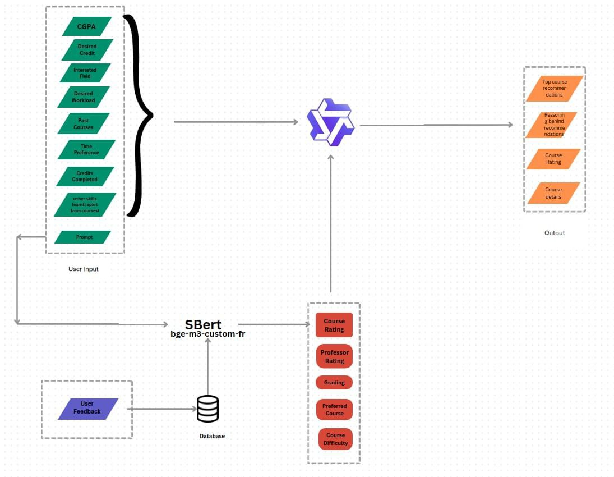

# WARP-Amazon

# 🎓 Course Recommender System – Web App

This is a smart and user-friendly web application that recommends courses based on your interests. It combines a React frontend with a FastAPI backend and uses AI models like BERT and large language models (LLMs) to give personalized course suggestions.

---

## 🧩 What It Does

- Stores user information in a secure database
- Uses a variety of courses from Coursera
- Recommends the best-fit courses using AI
- Personalized experience for every user

---

## 🌟 Key Features

- 📚 Course listings with categories and ratings  
- 🤖 Personalized course recommendations powered by AI
- 🔐 Secure data handling
- 🌐 Built with modern web technologies

---

## 🛠️ Tech Stack

### Frontend (React)
- React (JavaScript)
- Styled with Tailwind CSS

### Backend (FastAPI)
- Python with FastAPI and Pydantic
- BERT model for understanding course/user data and user requirements
- LLM (Qwen2.5-14B-Instruct-W8A8-Dynamic-Per-Token) for smart recommendations

### Database
- PostgreSQL
- SQLAlchemy

---



---

## 🚀 How to Run the Project

### 1. Clone the repository

```bash
git clone https://github.com/AISocietyIITJ/WARP-Amazon.git
cd WARP-Amazon
```

### 2. Download the model
- Qwen 2.5-14B Instruct: https://huggingface.co/mohitdeharkar/warp_Qwen2.5-14B-Instruct/tree/main
- BERT fine-tuned model: https://huggingface.co/mohitdeharkar/warp_fine_tuned_bge_m3/tree/main

### 3. Run the Backend (FastAPI)

```bash
cd backend
python -m venv venv
source venv/bin/activate  # For Windows: venv\Scripts\activate
pip install -r requirements.txt
uvicorn main:app --reload
```

### 4. Run the Frontend (React JS)
```bash
cd frontend
npm install
npm start
```


